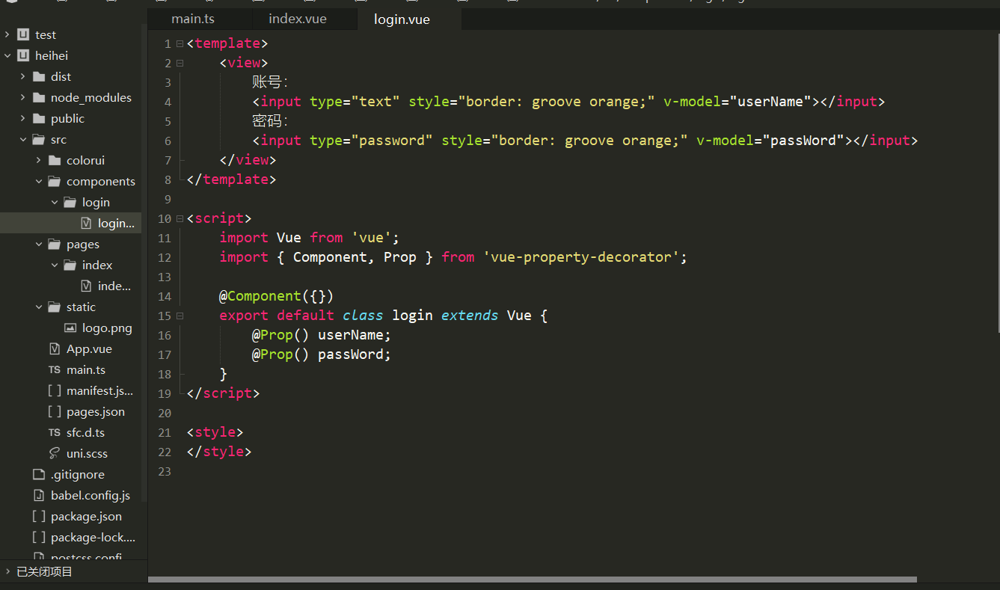
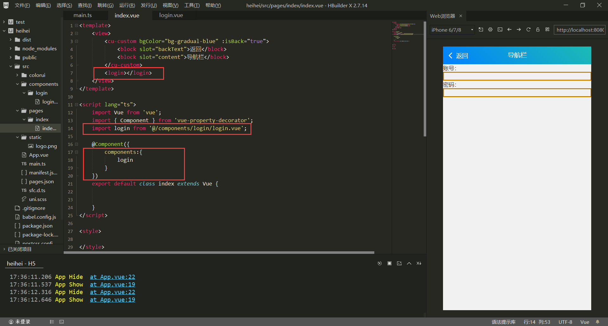
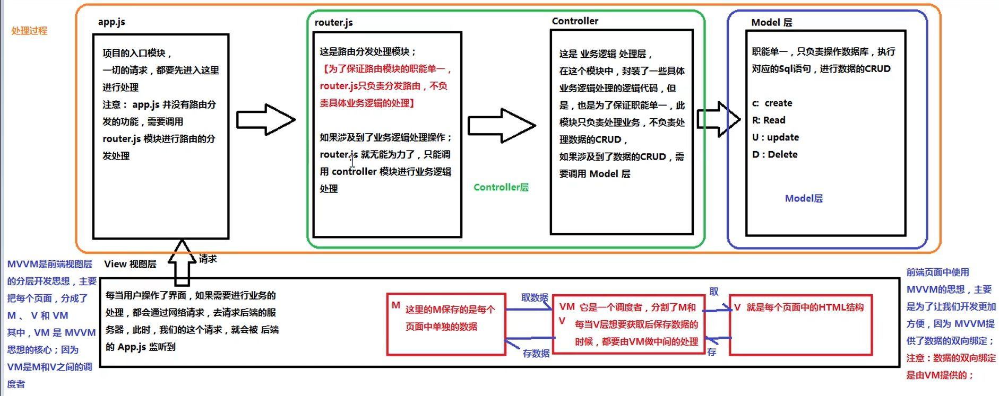

> vue.js是一套用于构建用户界面的渐进式框架。vue被设计为可以自底向上逐层应用。vue的核心只关注视图层。

## 一. 目录解析
|   目录   |  说明   |
|  ----    |  ----  |
| node_modules  | 	npm 加载的项目依赖模块 |
| src  | 这里是我们要开发的目录，基本上要做的事情都在这个目录里。里面包含了几个目录及文件：<br>* assets: 放置一些图片，如logo等。<br>* components: 目录里面放了一个组件文件，可以不用。<br>* App.vue: 项目入口文件，我们也可以直接将组件写这里，而不使用 components 目录。<br>* main.js: 项目的核心文件。 |
|src-static|	静态资源目录，如图片、字体等。|
|package.json|	项目配置文件。|
> 在项目运行中，main.js作为项目的入口文件，找到其实例需要挂载的位置，即index.html中。刚开始，index.html的挂载点处的内容会被显示，但是随后就被实例中的组件中的模板中的内容所取代，所以我们会看到有那么一瞬间会显示出index.html中正文的内容。而index.html中的Title部分不会被取代，所以会一直保留。


## 二. 基本语法
```
<template>
	//页面/组件的模板部分
    //在模板中我们可以用两个花括号将变量名括起来来代替变量的值：
</template>

<script lang="ts">
    import Vue from 'vue'; //导入模块或其他组件到这个.vue文件中
	import { Component } from 'vue-property-decorator'; //导入模块或其他组件到这个.vue文件中
	
	@Component({}) 
    //vue+ts中的装饰器，每个.vue文件最好都加一个这个

	export default class XXX extends Vue {
        text:string = 'I love limfx' //变量名:类型 = 值
        //ts代码写在这里
	}
</script>//ts的部分用来写页面/组件的逻辑

<style>//样式表，用来写页面/组件的样式
</style>
```
在模板中，除了用花括号的形式表示变量，还可以用表单类元素v-model：
此外还有其他的指令：v-if、v-else、v-show、v-html
```
<template>
	<view>
        <cu-custom bgColor="bg-gradual-blue" :isBack="true">
            <block slot="backText">返回</block>
            <block slot="content">导航栏</block>
        </cu-custom>
		请输入内容：<input style="border: groove orange;" v-model="text" @input="inputEvent"></input>
        // 事件响应调用相应函数，如此处输入的时候调用inputEvent函数
		<text>{{ inputValue }}</text>
	</view>
</template>

<script lang="ts">
    import Vue from 'vue';
	import { Component } from 'vue-property-decorator';
	
	@Component({})
	export default class index extends Vue {
		text:string = '';
		inputValue:string  = '';
		
		inputEvent() {
			this.inputValue = this.text;
            //在script中调用变量的时候需要用：this.变量名的形式调用，在函数内定义的局部变量则不需要，可以直接调用。
		}
	}
</script>
<style>
</style>
```

### 1. 函数的声明：
```
func（param1:type，param2:type,...）:type{
    ...
    return XXX;
}
//for example
login(username:string, password:string):boolean {
    var islogin;
    if(username=="123" && password=="123"){
        islogin = true;
    }else{
        islogin = false;
    }
    return islogin;
}

var loginState = login("123", "123");
console.log(loginState);
//结果为true
```
### 2. 不同组件之间的调用



### 3. MVVM与MVC


## 三. 基础语句
参考教程：https://blog.csdn.net/weixin_43342105/article/details/106153672
### 1. 插值操作：将值插入我们模板的内容当中
#### ①Mustache
```
<div id="app">
  <h2>{{message}}</h2>
  <h2>{{message}}, 李银河!</h2>
</div>
```
mustache语法中,不仅仅可以直接写变量,也可以写简单的表达式
```
<div id="app">
  <h2>{{firstName + lastName}}</h2>
  <h2>{{firstName + ' ' + lastName}}</h2>
  <h2>{{firstName}} {{lastName}}</h2>
  <h2>{{counter * 2}}</h2>
</div>
```
#### ②v-text
作用和Mustache相同；通常情况下接受string类型
```
  <h2 v-text="message"></h2>
  <h2>{{message}}</h2>
```
#### ③v-once
只会渲染一次，之后不会随变量改变而改变
```
<p v-once>{{msg}}</p>  <!-- //msg不会改变 -->
<p>{{msg}}</p>
```
#### ④v-html
可以解析出{{}}内string的html代码并显示，若不加则会输出html源代码
#### ⑤v-pre
会直接输出原本内容，不会经过解析
```
  <p>{{message}}</p>         //输出:message内容
  <p v-pre>{{message}}</p>   //输出:{{message}}
```
#### ⑥v-cloak(斗篷，遮盖物)
可以使用 v-cloak 指令设置样式，这些样式会在 Vue 实例编译结束时，从绑定的 HTML 元素上被移除。

当网络较慢，网页还在加载 Vue.js ，而导致 Vue 来不及渲染，这时页面就会显示出 Vue 源代码。我们可以使用 v-cloak 指令来解决这一问题。
```
<div id="app" v-cloak>
  <h2>{{message}}</h2>
</div>

<script src="../js/vue.js"></script>
<script>
  // 在vue解析之前, div中有一个属性v-cloak
  // 在vue解析之后, div中没有一个属性v-cloak
  setTimeout(function () {
    const app = new Vue({
      el: '#app',
      data: {
        message: '你好啊'
      }
    })
  }, 1000)
</script>
```
### 2. 绑定属性
#### ①v-bind
作用：动态绑定属性，如图片url，网页href
```
<div id="app">
  <a v-bind:href="Link">Vuejs官网</a>
  
</div>

<script src="../js/vue. js"></script>
<script>
	Let app = new
	Vue({
		el :
		'#app"
		data: {
			logoURL: 'https://vuejs.org/ images/ logo.png'，
			link: 'https://vuejs.org/ '
		}
	})
</script>
```
语法糖：
```
<div id="app">
	<a :href="link">Vuejs官网</a>
	
</div>
```
#### v-bind动态绑定class的多种方法
Ⅰ.对象语法  

Ⅱ.数组语法